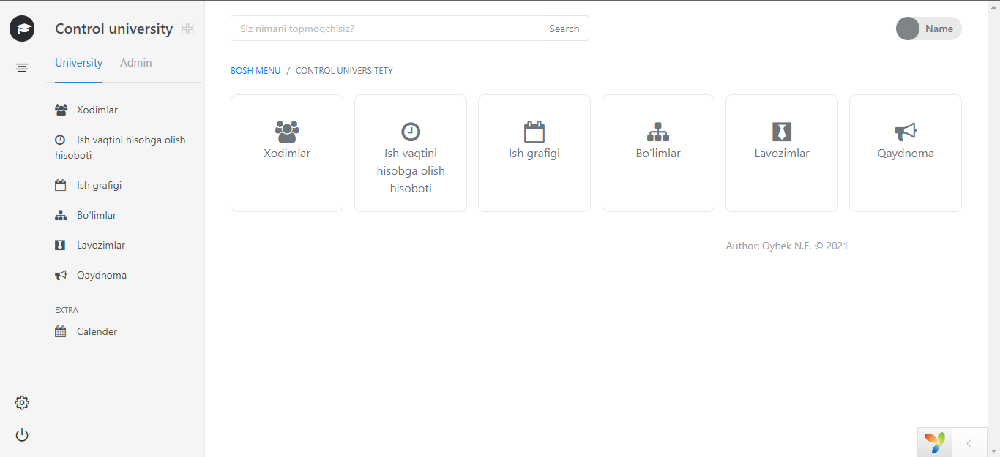
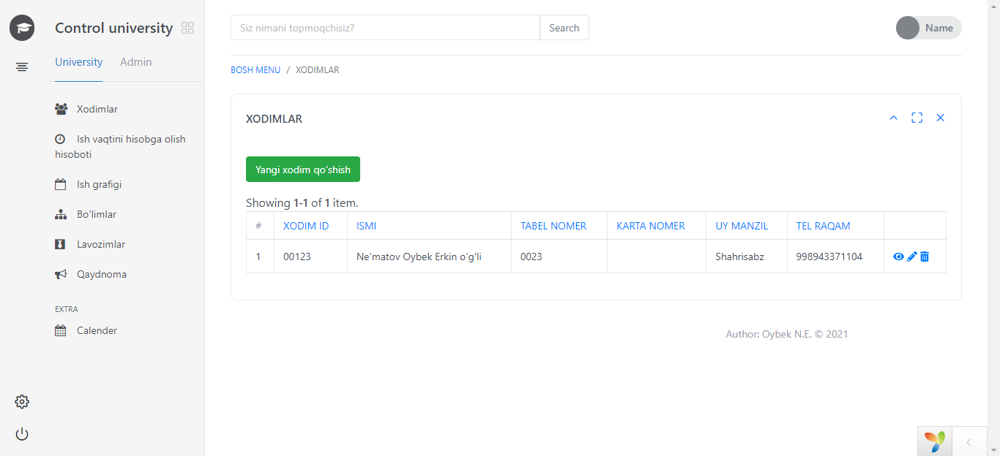
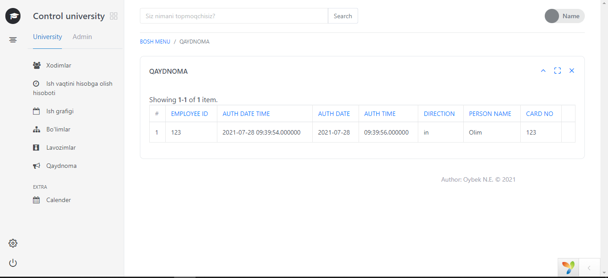

# faceControl_demo yii2 framework muduli 
ishchi xodimlarni, ishga o'z vaqtida kelib-ketish jarayonini nazoratga olish, ya'ni kunlik qaydnomani yuritish uchun yordam beradi.
Ushbu modul, IVMS 4200 dasturi bilan integratsiya qilishda qo'l keladi.

Kirish:

Modul asosiy sahifasiga kirish:

Modul asosiy sahifasi stilini o'zgartirish paneli:

Modul asosiy sahifasi stilini o'zgartirish:

Xodimlar haqida ma'lumot sahifasi:

Yangi ishchi xodimlar qo'shish sahifasi:

Ish grafigi haqida ma'lumot beruvchi sahifa:

Qaydnoma sahifasi:

